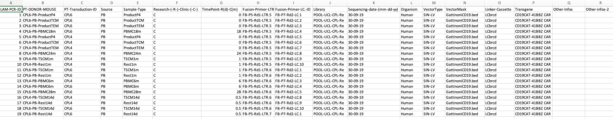

<!-- README.md is generated from README.Rmd. Please edit that file -->

```{r, include = FALSE}
knitr::opts_chunk$set(
  collapse = TRUE,
  comment = "#>"
)
```

# IS-Seq

<!-- badges: start -->
<!-- badges: end -->
IS-Seq is a pipeline for identifying insert sites on host genome when using viral vectors in gene therapy.

## Introduction

This is a new version of IS-Seq pipeline maintained by Docker, the purpose of this version is to let users not need to spend time to install the tools required for IS-Seq across different platforms except git, git-lfs and Docker.

### To use this IS-Seq version, you need to install Docker, git and git-lfs through the following insturction:

```

# Install Docker by using the following link on your system

https://docs.docker.com/engine/install/


# Install Homebrew firstly if you don't have brew installed on your Macs 

/bin/bash -c "$(curl -fsSL https://raw.githubusercontent.com/Homebrew/install/HEAD/install.sh)"

# Use brew to install git and git-lfs 
brew install git
brew install git-lfs

# Under your $HOME, pull IS-Seq repository

git clone https://github.com/aiminy/IS-Seq-python3.git
cd IS-Seq-python3
git lfs pull

# Pull IS-Seq Docker image

After docker is installed, you can pull IS-Seq Docker image like the following

docker pull aiminy/isseq:2.4

```

### To have a quick start to using IS-Seq, you can run the following command:
```{bash eval=FALSE, message=FALSE, warning=FALSE, results='hide'}

docker run aiminy/isseq:2.4 python IS-Seq-python3/ISpipelineFv3_test.py -h

```

* Command line arguments:

  * -1 R1 read file for pair-ended sequencing files
  
  * -2 R2 read file for pair-ended sequencing files
  
  * -s sample name, e.g. "POOL-UCL-CPL-Re"  
  
  * -o The folder name of your output
  
  note: user should not use underscore(_) in the output folder name and file name because of special meanings of
  underscore(_) in Python
  
  * -t time you run this pipeline
  
  * -r association file. User should prepare an assocation file based on the formats in "Association_File_format.png" in "sample_research" folder. you can check the detailed format information here {width=100%}. The following is the detailed information of each column in this format:
    
    * 1: LAM-PCR-ID	
    * 2: PT-DONOR-MOUSE	
    * 3: PT-Transduction-ID	
    * 4  Source	
    * 5: Sample-Type	
    * 6: Research-(-R-)-Clinic-(-C-)	
    * 7: TimePoint-R(d)-C(m) use month as measurement unit	
    * 8: Fusion-Primer-LTR.-ID	note: you shoud use give this like "FB-P5-Rd1-LTR.1",FB-P5-Rd1-LTR-1 will give an error  
    * 9: Fusion-Primer-LC.-ID	note: format requirement for LC barcode is like format requirement as LTR barcode
    * 10: Library, this is same as sample name in comand line arguments	
    * 11: Sequencing-date-(mm-dd-yy)	
    * 12: Organism	
    * 13: VectorType	
    * 14: VectorMask	
    * 15: Linker-Cassette	
    * 16: Transgene	
    * 17: Other-Infos	
    * 18: Other-infos-2
  
      note: user should not use underscore(_) in these column name and their entries in this table because of special meanings in Python
  
  * -u The folder you put reference data 
  
  * -p The folder for auxiliary scripts you need in IS-SeqlineFv3_test.py
  
  * -a analysis type, e.g. "read","missingIS","VectorCount","align2Vector","umi" or "fragment", 
  
  * -c the previous folder, this is a folder including those *grouped_IS file from previous run:
  
Note: you need to follow these order to run IS-Seq:

* You need to set up which genome will be used as reference genome in the association file Organism column, currently, the accepted genome is Human(hg19),hg38 and Mouse(mm10).

* You need to run ReadBased("-a read") firstly because the runs for "missingIS","VectorCount","umi" or "fragment" depends on the intermediate files from ReadBased.

* After you finished ReadBased run, if you want to get "missingIS", you just need to set '-a missingIS'.

* If you want to run '-a VectorCount', you need to finish '-a missingIS' firstly.

* align2Vector If you want to align all reads(not missing reads) on vector, use this analysis type

* To set the previous folder in -c, you need to follow the following rule:

  for example:
  
  You can find "*grouped_IS" files by using /home/user/Seagate/ISseqOutput/Oct22New/CutAdapt/filterNo/db/*grouped_IS
  
  The previous folder name you need to give is /home/user/Seagate/ISseqOutput/Oct22New
  
### To make reference genome data for hg38, you need to run the following command:

```{bash eval=FALSE, message=FALSE, warning=FALSE, results='hide'}

nohup docker run --network 'host' --rm -v path/to/ISseqOutput:/out aiminy/isseq:2.4 Rscript /usr/src/IS-Seq-python3/R/makeREFIndex1.R -i https://ftp.ebi.ac.uk/pub/databases/gencode/Gencode_human/release_41/GRCh38.primary_assembly.genome.fa.gz -g https://ftp.ebi.ac.uk/pub/databases/gencode/Gencode_human/release_41/gencode.v41.annotation.gtf.gz -r https://hgdownload.soe.ucsc.edu/goldenPath/currentGenomes/Homo_sapiens/database/rmsk.txt.gz -m https://hgdownload.cse.ucsc.edu/goldenpath/hg38/database/chromInfo.txt.gz -o /out/utilsRefData/hg38/GRCh38.primary_assembly.genome.fa > logMakeHg38.txt 2>&1 &

```

### To get ReadBased results, you need to run the following command:

```{bash eval=FALSE, message=FALSE, warning=FALSE, results='hide'}

nohup docker run --rm -v path/to/IS-Seq-python3/data:/in --rm -v  path/to/IS-Seq-python3/sample_research:/in1 --rm -v path/to/ISseqOutput/utilsRefData:/in2 --rm -v path/to/ISseqOutput:/out aiminy/isseq:2.4 python /usr/src/IS-Seq-python3/ISpipelineFv3_test.py -1 /in/simulationUp_R1.fq.gz -2 /in/simulationUp_R2.fq.gz -s POOL-ISA-AVRO-6-Preclin -o /out -t DEMO -r /in1/20210121_AssociationFIle_POOL6_Preclinical.csv -u /in2 -p /usr/src/IS-Seq-python3/utils -a read -c nothing -q 30 > path/to/ISseqOutput/log/logDEMO_read.txt 2>&1 &

```

### To get UmiBased results, you need to run the following command:
```{bash eval=FALSE, message=FALSE, warning=FALSE, results='hide'}

nohup docker run --rm -v path/to/IS-Seq-python3/data:/in --rm -v  path/to/IS-Seq-python3/sample_research:/in1 --rm -v path/to/ISseqOutput/utilsRefData:/in2 --rm -v path/to/ISseqOutput:/out aiminy/isseq:2.4 python /usr/src/IS-Seq-python3/ISpipelineFv3_test.py -1 /in/simulationUp_R1.fq.gz -2 /in/simulationUp_R2.fq.gz -s POOL-ISA-AVRO-6-Preclin -o /out -t DEMO -r /in1/20210121_AssociationFIle_POOL6_Preclinical.csv -u /in2 -p /usr/src/IS-Seq-python3/utils -a umi -c nothing -q 30 > path/to/ISseqOutput/log/logDEMO_umi.txt 2>&1 &

```

### To get FragmentBased results, you need to run the following command:
```{bash eval=FALSE, message=FALSE, warning=FALSE, results='hide'}

nohup docker run --rm -v path/to/IS-Seq-python3/data:/in --rm -v  path/to/IS-Seq-python3/sample_research:/in1 --rm -v path/to/ISseqOutput/utilsRefData:/in2 --rm -v path/to/ISseqOutput:/out aiminy/isseq:2.4 python /usr/src/IS-Seq-python3/ISpipelineFv3_test.py -1 /in/simulationUp_R1.fq.gz -2 /in/simulationUp_R2.fq.gz -s POOL-ISA-AVRO-6-Preclin -o /out -t DEMO -r /in1/20210121_AssociationFIle_POOL6_Preclinical.csv -u /in2 -p /usr/src/IS-Seq-python3/utils -a fragment -c nothing -q 30 > path/to/ISseqOutput/log/logDEMO_Frag.txt 2>&1 &

```
