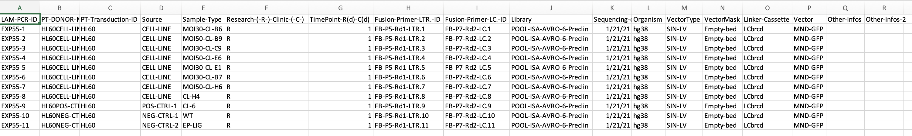

<!-- README.md is generated from README.Rmd. Please edit that file -->

# IS-Seq

<!-- badges: start -->
<!-- badges: end -->

IS-Seq is a pipeline for identifying integration sites on host genome
when using viral vectors in gene therapy. The detailed information about
this pipeline, user can read this
[paper](https://doi.org/10.1101/2023.02.06.527381), Particularly,
Figure1 and Figure2 of this paper describe the steps of this pipeline.

Main structure of IS-Seq pipeline is based on processing and excluding a
mosaic of oligos primer, adapters, sample barcodes, viral Long Terminal
Repeat (LTR) sequences in order to release the host genomic DNA which
will then be aligned to the host reference genome for the retrospective
identification of the insertion sites.

## Introduction

The IS-Seq pipeline is maintained by Docker, the purpose of using Docker
is to let users not need to spend time to install the tools required for
IS-Seq across different platforms except git, git-lfs and Docker.

### To use this IS-Seq, you need to install Docker, git and git-lfs through the following steps:


    # Install Docker by using the following link on your system

    https://docs.docker.com/engine/install/


    # Install Homebrew firstly if you don't have brew installed on your Macs 

    /bin/bash -c "$(curl -fsSL https://raw.githubusercontent.com/Homebrew/install/HEAD/install.sh)"

    # Use brew to install git and git-lfs 
    brew install git
    brew install git-lfs

    # Under your $HOME, pull IS-Seq repository

    git clone https://github.com/aiminy/IS-Seq-python3.git
    cd IS-Seq-python3
    git lfs pull

    # Pull IS-Seq Docker image

    After docker is installed, you can pull IS-Seq Docker image like the following

    docker pull aiminy/isseq:2.5

### To have a quick start to using IS-Seq, you can run the following command:

``` bash

docker run aiminy/isseq:2.5 python IS-Seq-python3/IS-Seq.py -h
```

-   Command line arguments:

    -   -1 R1 read file for pair-ended sequencing files

    -   -2 R2 read file for pair-ended sequencing files

    -   -s sample name, e.g. “POOL-ISA-AVRO-6-Preclin”

    -   -o The folder name of your output

    note: user should not use underscore(*) in the output folder name
    and file name because of special meanings of underscore(*) in Python

    -   -t time you run this pipeline

    -   -r association file. User should prepare an assocation file
        based on the formats in “Association_File_format.png” in
        “sample_research” folder. you can check the detailed format
        information here
        . The following is the
        detailed information of each column in this format:

        -   1: LAM-PCR-ID(required,used for sample information)  

        -   2: PT-DONOR-MOUSE(required,used for sample information)  

        -   3: PT-Transduction-ID(required, used for collision
            detection)

        -   4 Source(required, used for sample information)  

        -   5: Sample-Type(required,used for sample information)  

        -   6: Research-(-R-)-Clinic-(-C-)(required,used for sample
            information)  

        -   7: TimePoint-R(d)-C(m) use month as measurement
            unit(required,used for sample information)  

        -   8: Fusion-Primer-LTR.-ID note: you shoud use give this like
            “FB-P5-Rd1-LTR.1”,FB-P5-Rd1-LTR-1 will give an
            error(required, used for R1 demultiplexing)  

        -   9: Fusion-Primer-LC.-ID note: format requirement for LC
            barcode is like format requirement as LTR barcode(required)

        -   10: Library, this is same as sample name in comand line
            arguments(required, used for R2 demultiplexing)  

        -   11: Sequencing-date-(mm-dd-yy)(required,used for sample
            information)  

        -   12: Organism(required, used for alignment)  

        -   13: VectorType(required,used for selecting vector
            type,currently we have ‘SIN-LV’ or ‘RV’ 2 options)  

        -   14: VectorMask(required,but could be empty bed file)  

        -   15: Linker-Cassette(required,used for R2 LC processing)

        -   16: Vector(required, used for selecting vector,currently we
            have ‘MND-GFP’, ‘GlucoCco’, ‘IUPF-CTNS’ and
            ‘pCDY-EFS-hGLAco’ 4 options)

        -   17: Other-Infos (optional)  

        -   18: Other-infos-2 (optional)

            note: user should not use underscore(\_) in these column
            name and their entries in this table because of special
            meanings in Python

    -   -u The folder you put reference data

    -   -p The folder for auxiliary scripts you need in IS-Seq.py

    -   -a analysis type,
        e.g. “read”,“missingIS”,“VectorCount”,“align2Vector”,“umi” or
        “fragment”,

    -   -c the previous folder, this is a folder including those
        \*grouped_IS file from previous run:

Note: you need to follow these order to run IS-Seq:

-   You need to set up which genome will be used as reference genome in
    the association file Organism column, currently, the accepted genome
    is Human(hg19),hg38 and Mouse(mm10).

-   You need to run ReadBased(“-a read”) firstly because the runs for
    “missingIS”,“VectorCount”,“umi” or “fragment” depends on the
    intermediate files from ReadBased.

-   After you finished ReadBased run, if you want to get “missingIS”,
    you just need to set ‘-a missingIS’.

-   If you want to run ‘-a VectorCount’, you need to finish ‘-a
    missingIS’ firstly.

-   align2Vector If you want to align all reads(not missing reads) on
    vector, use this analysis type

-   To set the previous folder in -c, you need to follow the following
    rule:

    for example:

    You can find “*grouped_IS” files by using
    /home/user/Seagate/ISseqOutput/Oct22New/CutAdapt/filterNo/db/*grouped_IS

    The previous folder name you need to give is
    /home/user/Seagate/ISseqOutput/Oct22New

### To make reference genome data for hg38, you need to run the following command:

``` bash

nohup docker run --rm -v path/to/IS-Seq-python3/utilsRefData/IsSeq:/out aiminy/isseq:2.5 Rscript /usr/src/IS-Seq-python3/R/makeREFIndex1.R -i https://ftp.ebi.ac.uk/pub/databases/gencode/Gencode_human/release_41/GRCh38.primary_assembly.genome.fa.gz -g https://ftp.ebi.ac.uk/pub/databases/gencode/Gencode_human/release_41/gencode.v41.annotation.gtf.gz -r https://hgdownload.soe.ucsc.edu/goldenPath/currentGenomes/Homo_sapiens/database/rmsk.txt.gz -m https://hgdownload.cse.ucsc.edu/goldenpath/hg38/database/chromInfo.txt.gz -o /out/hg38/GRCh38.primary_assembly.genome.fa > path/to/ISseqOutput/log/logMakeHg38.txt 2>&1 &
```

### To get ReadBased results, you need to run the following command:

``` bash

nohup docker run --rm -v path/to/IS-Seq-python3/data:/in --rm -v  path/to/IS-Seq-python3/sample_research:/in1 --rm -v path/to/IS-Seq-python3/utilsRefData/IsSeq:/in2 --rm -v path/to/ISseqOutput:/out aiminy/isseq:2.5 python /usr/src/IS-Seq-python3/IS-Seq.py -1 /in/simulationUp_R1.fq.gz -2 /in/simulationUp_R2.fq.gz -s POOL-ISA-AVRO-6-Preclin -o /out -t DEMO -r /in1/20210121_AssociationFIle_POOL6_Preclinical.csv -u /in2 -p /usr/src/IS-Seq-python3/utils -a read -c nothing -q 30 > path/to/ISseqOutput/log/logDEMO_read.txt 2>&1 &
```

### To get UmiBased results, you need to run the following command:

``` bash

nohup docker run --rm -v path/to/IS-Seq-python3/data:/in --rm -v  path/to/IS-Seq-python3/sample_research:/in1 --rm -v path/to/IS-Seq-python3/utilsRefData/IsSeq:/in2 --rm -v path/to/ISseqOutput:/out aiminy/isseq:2.5 python /usr/src/IS-Seq-python3/IS-Seq.py -1 /in/simulationUp_R1.fq.gz -2 /in/simulationUp_R2.fq.gz -s POOL-ISA-AVRO-6-Preclin -o /out -t DEMO -r /in1/20210121_AssociationFIle_POOL6_Preclinical.csv -u /in2 -p /usr/src/IS-Seq-python3/utils -a umi -c nothing -q 30 > path/to/ISseqOutput/log/logDEMO_umi.txt 2>&1 &
```

### To get FragmentBased results, you need to run the following command:

``` bash

nohup docker run --rm -v path/to/IS-Seq-python3/data:/in --rm -v  path/to/IS-Seq-python3/sample_research:/in1 --rm -v path/to/IS-Seq-python3/utilsRefData/IsSeq:/in2 --rm -v path/to/ISseqOutput:/out aiminy/isseq:2.5 python /usr/src/IS-Seq-python3/IS-Seq.py -1 /in/simulationUp_R1.fq.gz -2 /in/simulationUp_R2.fq.gz -s POOL-ISA-AVRO-6-Preclin -o /out -t DEMO -r /in1/20210121_AssociationFIle_POOL6_Preclinical.csv -u /in2 -p /usr/src/IS-Seq-python3/utils -a fragment -c nothing -q 30 > path/to/ISseqOutput/log/logDEMO_Frag.txt 2>&1 &
```

### The outputs of IS-Seq pipeline:


    IS-Seq pipeline outputs integration profiles in filterNO and filter60 files by 3 methods(ReadBased, UmiBased and FragmentBased), the format of these output files are same. Each row indicats one integration site and the 1st to the 4th coulumn of each row are the coordinates of integration site(chromosome,position and strand), the 5th column of each row is the closed gene to the integration site. The columns after the 5th column is abundance of the integration site for the corresponding samples. 

    The following is an example output from a simulated data set supplied with this repository. 

    Note: This simluated data set includes 1 integration site for one sample only   

    chr     pos     chrInt  strand  V7      CL.6_POS.CTRL.1_1
    chr19   49461738        19      -       ALDH16A1        2924
